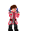
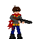
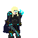

# Gallery

In here is a display of the work I have done in the past.

  
  
Add a description of the image here

  
  
Add a description of the image here

  
  
Add a description of the image here

  
  
Add a description of the image here

